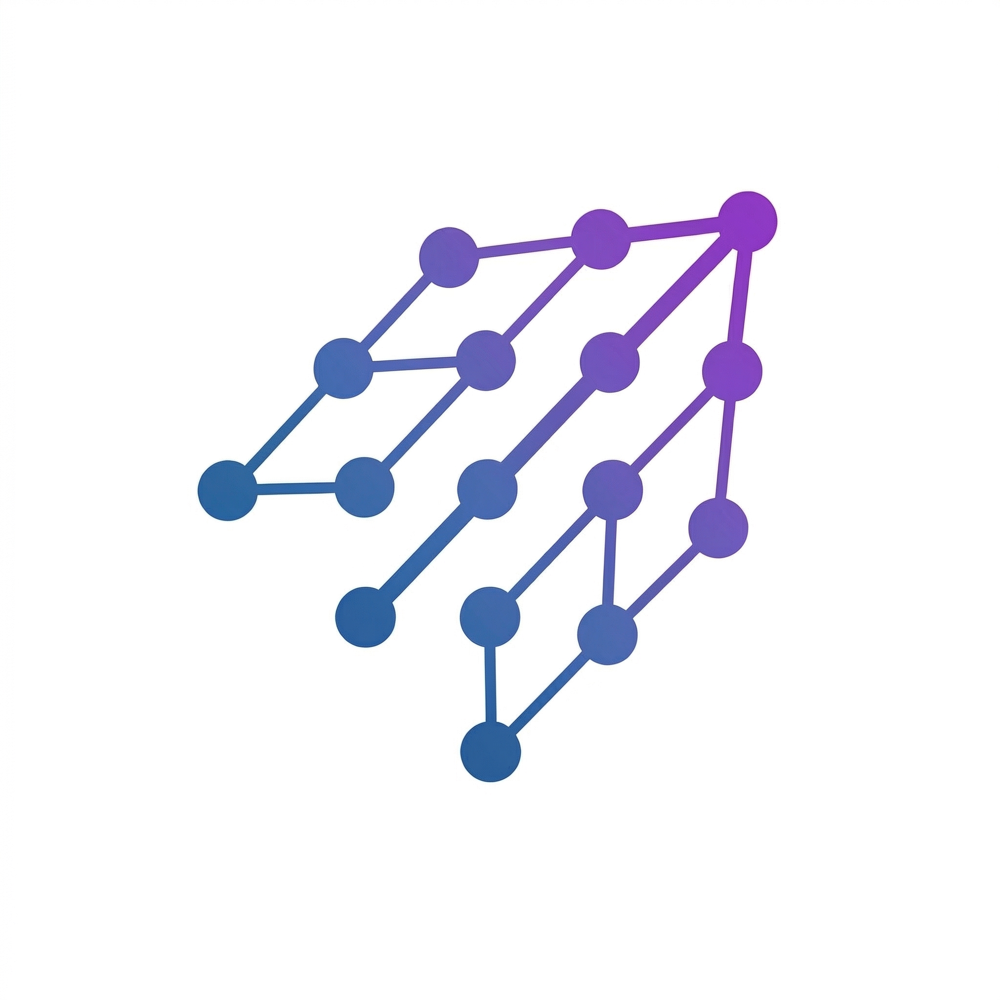

<p align="center">
  
  <h1 align="center">Brynq</h1>
  <p align="center"><strong>All your AI models. One app.</strong></p>
</p>

---

Brynq connects the AI tools you already use — Gemini, Claude, ChatGPT, Llama, Mistral — and makes them work together. Log in with Google, and Brynq automatically finds every model on your machine.

No new subscriptions. No API keys to manage. Your AI, orchestrated.

```
You: "Research the latest on solid-state batteries and summarize the key breakthroughs"

  Gemini:  Searching recent papers and news... Found 12 key developments
           in 2025-2026 including Toyota's sulfide electrolyte breakthrough...

  Claude:  Analyzing Gemini's findings. The most significant trend is the
           shift from oxide to sulfide electrolytes, which reduces interface
           resistance by 10x...

  Llama:   Summary: Three breakthroughs matter most — (1) Toyota's sulfide
           cells hitting 500 Wh/kg, (2) QuantumScape's solid-state pouch
           cells passing automotive qualification, (3) Samsung SDI's...
```

---

## Get started

### Option 1: Download the desktop app (easiest)

No Python needed. Just download, install, and run.

<p>
  <a href="https://github.com/khadkutamaihaine/Brynq/releases/latest/download/Brynq_0.3.0_x64-setup.exe">
    <strong>Download for Windows (.exe)</strong>
  </a>
  &nbsp;&nbsp;|&nbsp;&nbsp;
  macOS / Linux coming soon
</p>

### Option 2: Install via pip

Requires Python. If you don't have it, install these first:

**What you need:**

| Software | What it does | Get it |
|----------|-------------|--------|
| **Python 3.10+** | Runs Brynq | [python.org/downloads](https://www.python.org/downloads/) |
| **Ollama** (optional) | Free local AI models (Llama, Mistral) | [ollama.com/download](https://ollama.com/download) |

That's it. Google login and Claude detection are built in — no extra installs.

```bash
pip install brynq

brynq-runtime start     # Opens the app in your browser
brynq-runtime models    # See all detected models
brynq-runtime status    # Check connections
```

Brynq will automatically detect everything on your machine — Ollama models, Claude CLI, Google account.

---

## How it works

### 1. Log in with Google

One click. Uses your existing Google account to access Gemini. No API keys, no credit card, no extra charges.

### 2. Brynq detects your models

Have Claude installed? Ollama running? Brynq finds them automatically. Nothing to configure.

| Model | How Brynq finds it | Cost to you |
|-------|-------------------|-------------|
| **Gemini** | Google OAuth (one-click login) | Your existing Google account |
| **Claude** | Auto-detected if installed on your machine | Your existing subscription |
| **Llama, Mistral, Phi** | Auto-detected via Ollama | Free (runs on your hardware) |
| **ChatGPT** | Auto-detected or paste API key | Your existing subscription or API key |
| **Any Ollama model** | Auto-detected | Free |

### 3. They work together

You ask once. Brynq figures out which model handles which part, then executes locally on your machine. Five strategies:

- **Sequential** — One model's output feeds the next
- **Fan-Out** — Multiple models answer in parallel, best response wins
- **Debate** — Models critique each other's answers
- **Refine** — One drafts, another improves, repeat
- **Single** — Route to the best model for this specific task

---

## Marketplace

Specialized AI agents built by experts. Use them directly from Brynq — they run on our servers, so you never download the model.

| Agent | What it does |
|-------|-------------|
| **Civil Engineer** | Structural analysis, beam design, code compliance (AISC, IS 456) |
| **Sigma ML Engineer** | Model drift detection, health audits, training oversight |
| **Delta Data Pipeline** | Schema validation, freshness monitoring, data quality |
| **Omega Compliance** | Regulatory tracking, audit trails, policy enforcement |
| **Alpha Performance** | Latency profiling, bottleneck detection, capacity planning |
| **Theta Infrastructure** | Service health, deployment validation, incident diagnosis |
| **Conductor Lifecycle** | Standup generation, task prioritization, sprint health |

Free during early access. [Learn more at brynq.ai](https://brynq.ai)

---

## Why Brynq

**No extra charges** — Uses the subscriptions and tools you already have. No surprise bills.

**Private by default** — Local models run entirely on your computer. Your data never leaves your machine.

**Smarter together** — Models fact-check each other. Together they produce better results than any single model.

**One conversation** — Stop juggling tabs. Ask once, get answers from your whole team, in one place.

---

## Security

- **Your keys stay local** — Encrypted on your machine, never sent to our servers.
- **Your data stays local** — Documents and conversations never leave your computer.
- **Tamper-proof** — Execution plans are cryptographically signed and time-limited.

---

## Requirements

| | Minimum | Recommended |
|--|---------|-------------|
| **OS** | Windows 10, macOS 12, Ubuntu 20.04 | Latest |
| **RAM** | 8 GB | 16 GB+ (for local models) |
| **GPU** | Not required | Any NVIDIA GPU (for faster local inference) |
| **Python** | 3.10+ (pip install only) | 3.11+ |
| **Disk** | 500 MB (Brynq only) | 10 GB+ (with Ollama models) |

---

## License

See [LICENSE](LICENSE) for details.

**Website:** [brynq.ai](https://brynq.ai)

Built by [Gurjeet Grewal](https://github.com/khadkutamaihaine).
